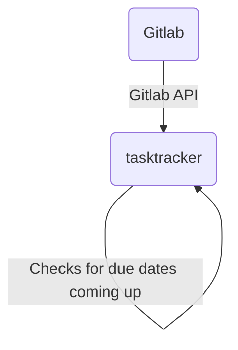
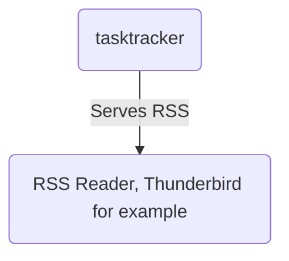
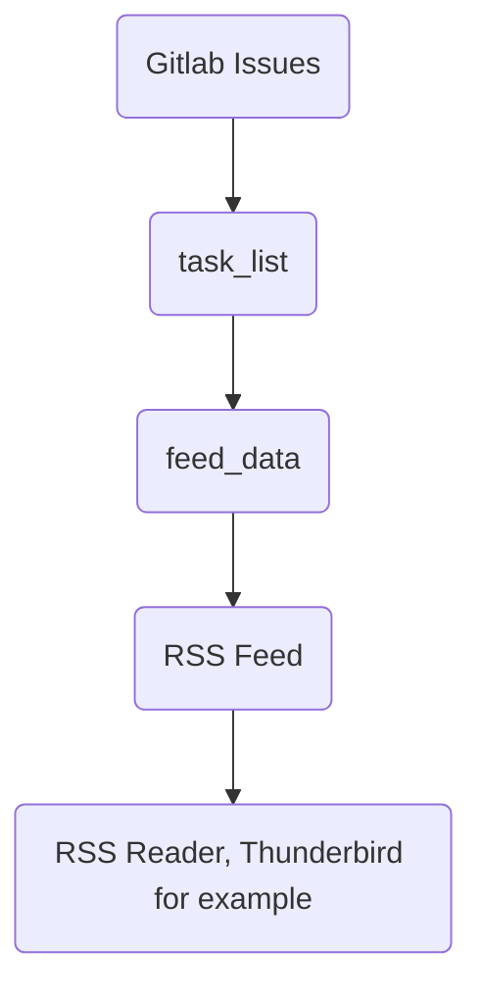

## About

Tool to collect issues from the Gitlab API, keeps track of tasks due dates, the task tracker serves an RSS feed, adding entries to the feed as the expiry date approaches and when a task expires.  
You can use it to keep track of anything with a due date in your Gitlab issues, for example certificate expiries, OS updates, car services, oil changes, seed planting, assignments.







## Third Party Libraries and Resources
  
- [libcurl](https://curl.se/libcurl/)  
- [libjson-c](https://github.com/json-c/json-c)  
- [libmicrohttpd](https://www.gnu.org/software/libmicrohttpd/)  
- [libxml2](https://github.com/GNOME/libxml2)

## Build

Install dependencies:

Ubuntu:
```bash
sudo apt install automake autoconf libtool texinfo gcc-c++ cmake libcurl-dev json-c-dev libxml2-dev gtest-dev
```

Fedora:
```bash
sudo dnf install automake autoconf libtool texinfo gcc-c++ cmake libcurl-devel json-c-devel libxml2-devel gtest-devel
```

Clone:
```bash
git clone git@github.com:pilkch/libsecurityheaders.git
git clone git@github.com:pilkch/task-tracker.git
cd task-tracker
```

Build:
```bash
$ cmake .
$ make -j
```

## Run the Unit Tests

```bash
$ ./unit_tests
```


## Usage

1. Optionally generate self signed certificates for TLS:
```bash
openssl genrsa -out server.key 2048
openssl rsa -in server.key -out server.key
openssl req -sha256 -new -key server.key -out server.csr -subj '/CN=localhost'
openssl x509 -req -sha256 -days 365 -in server.csr -signkey server.key -out server.crt
```
2. Set up a configuration.json file by copying the example configuration:
```bash
cp configuration.json.example configuration.json
```
3. Generate a random token (This method is slightly limited, but we can make it 64 characters which is pretty long, task-tracker doesn't care if it is longer or shorter, only that it is alphanumeric):
```bash
openssl rand -hex 64
```
4. Editing the configuration (Set your IP address and port, use "0.0.0.0" for the "ip" field if you are running task-trackerd in a container because it doesn't know about the external network interfaces, set the token, and optionally set the the server.key and server.crt, and gitlab url, certificate and token settings):
```bash
vi configuration.json
```
5. Open ports in firewalld (Replace 8443 with your port):
```bash
sudo firewall-cmd --permanent --add-port=8443/tcp
sudo firewall-cmd --reload
```

### Run task-tracker natively

1. Run task-tracker:
```bash
./task-trackerd
```

### OR, in a podman rootless container

1. Install dependencies:
```bash
sudo dnf install podman slirp4netns
```
2. Build the container:
```bash
podman build --tag fedora:tasktracker -f ./Dockerfile
```
3. Run the container (Replace the IP and port with your own):  
NOTE: We need to use `allow_host_loopback` when the gitlab server is on the same host as us, otherwise you get weird can't connect errors when task-trackerd tries to connect to gitlab  
```bash
mkdir -p feed_data
podman run --init -v ./feed_data:/root/task-tracker/feed_data:z --network slirp4netns:allow_host_loopback=true -p 192.168.0.3:8443:8443 --shm-size 256m --name tasktracker --rm fedora:tasktracker
```

### Use the feed

1. Go to the address in a browser to check that is working (Replace the address and port):  
```bash
wget --no-check-certificate https://192.160.0.3:8443/feed/atom.xml?token=<your token here>
```
2. Add this URL to your RSS feed reader.

## Fuzzing

### Fuzz the web server

**Note: This is super slow because we have to create a web server each time, and perform one request, that isn't too slow, but then we have to clean up which means requesting that any connect client threads exit, waiting for them to exit and generally cleaning up**  
Though, we can probably do some smarter checking in the web server clean up code and avoid waiting as long.

```bash
cd fuzz
make
mkdir -p ./corpus/fuzz_web_server_https_url/
./fuzz_web_server_https_url -runs=500000 -max_len=10000 -workers=2 -fork=1 -shrink=1 ./corpus/fuzz_web_server_https_url
```

```bash
cd fuzz
make
mkdir -p ./corpus/fuzz_web_server_https_request/
./fuzz_web_server_https_request -runs=500000 -max_len=10000 -workers=2 -fork=1 -shrink=1 ./corpus/fuzz_web_server_https_request
```

### Merge corpuses (Unless you create a new empty corpus directory you won't need this)

Merge items from corpus 2, 3, ... into corpus 1
```bash
rm -f ./MergeStatusControlFile
./fuzz_web_server_https_url corpus/fuzz_web_server_https_url/ corpus/new_items/ -merge=1 -merge_control_file=MergeStatusControlFile
```

## History

The idea for this application was originally to use a JSON file or sqlite database to specify the tasks with due dates for things like general tasks, car maintenance, TLS certificates expiry, API key expiry, domain renewal.  
Talking to my friend Paul about it, we realised everything I wanted was in gitlab issues, some of the issues already have due dates and I can just query them with the API.
